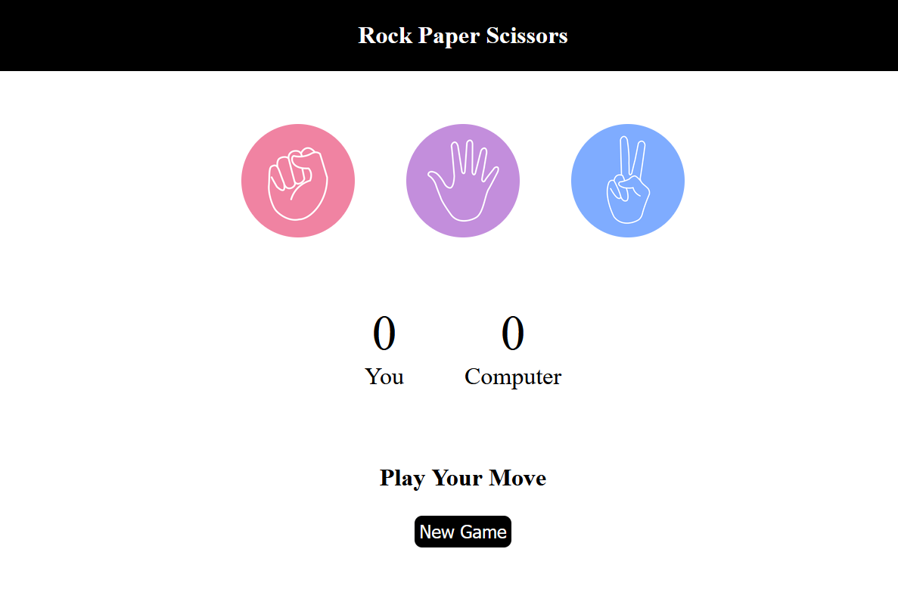
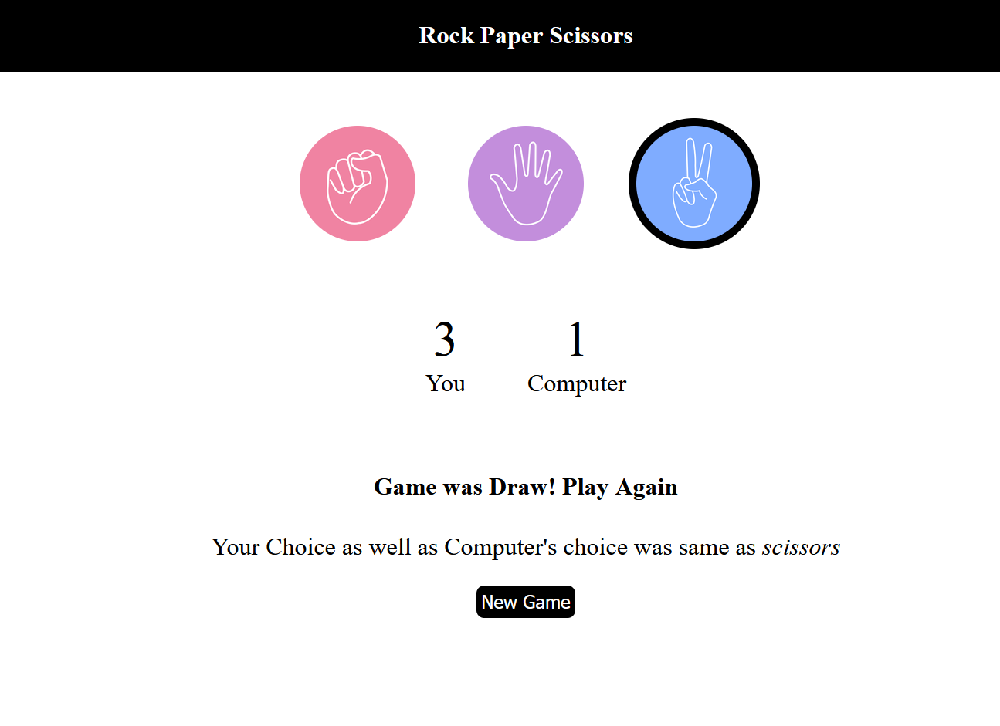

# ✊✋✌️ Rock Paper Scissors Game

<div align="center">


A classic Rock Paper Scissors game built with **HTML, CSS, and JavaScript** featuring score tracking, persistent storage, and an interactive user experience.

</div>

---

# 📖 Overview

This project recreates the classic Rock Paper Scissors game where players compete against the computer. The game uses JavaScript to generate random computer moves, determine the winner, and maintain scores using Local Storage.

---

# ✨ Features

- ✊ Rock, Paper & Scissors gameplay
- 🤖 Random computer moves
- 🏆 Win, Lose & Draw detection
- 📊 Live score tracking
- 💾 Score saved using Local Storage
- 🔄 Reset score functionality
- 📱 Responsive interface

---

# 🛠 Tech Stack

- HTML5
- CSS3
- JavaScript (ES6)

---

# 📸 Screenshots

## Home



---

## Gameplay



---

# 📂 Project Structure

```text
Rock-Paper-Scissors/
│
├── Screenshots/
├── rock-paper-scissors.html
├── rock-paper-scissors.css
├── rock-paper-scissors.js
├── rock.png
├── paper.png
├── scissors.png
└── README.md
```

---

# 🚀 Run Locally

Clone the repository

```bash
git clone https://github.com/VijayalaxmiSankpal/Rock-Paper-Scissors.git
```

Open `rock-paper-scissors.html` in your browser.

---

# 💡 Future Improvements

- Difficulty levels
- Sound effects
- Animations
- Multiplayer mode
- Dark mode

---

# 👩‍💻 Author

**Vijayalaxmi Sankpal**

📧 vijayalaxmisankpal@gmail.com

💼 LinkedIn  
https://www.linkedin.com/in/vijayalaxmi-sankpal-b99b4a25b

💻 GitHub  
https://github.com/VijayalaxmiSankpal

---

# ⭐ Support

If you found this project helpful, consider giving it a ⭐ on GitHub.

---

<div align="center">

**Built with HTML, CSS & JavaScript 🚀**

</div>